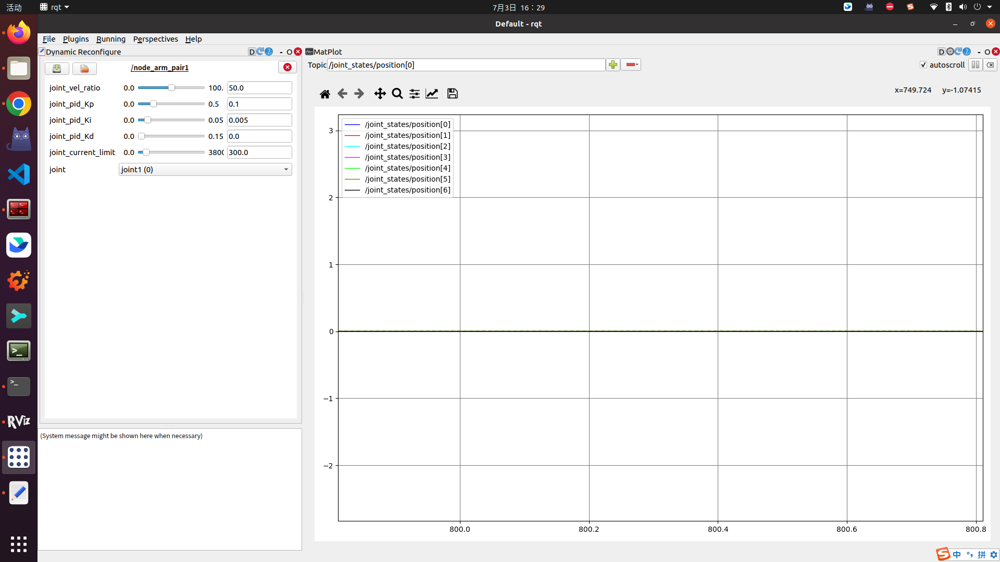

Start the robotic arm process:
1. Download this workspace from GitHub to your Ubuntu 20.04 system and run catkin_make to compile this workspace in the ws_robot_arm directory. If there is an error where the feature pack cannot be found, you need to download the relevant feature pack dependencies yourself
```
git clone git@github.com:Jacode-Robotics/RosFunctionExtension.git
cd RosFunctionExtension/ws_robot_arm/
catkin_make
```

2. View the dxl_config.yaml and dynamic_param.cfg file in the follow_control package and modify the relevant parameters according to the comments
3. Run the control physical.launch file. If you want to run it directly in one step, modify the setup.bash file path in the run.sh file and run run.sh directly
```
source ./devel/setup.bash
roslaunch follow_control control_physical.launch

or ./src/run.sh
```
You can refer to this video: [STR400 Sync Robot Tutorial - YouTube](https://www.youtube.com/watch?v=LY0OBegv0w4)

If you want the robotic arm to move quickly, you need to set the speed limit value of the motor higher before running this program. If the robotic arm experiences shaking, you need to check the shaking motor and reset the speed loop PID of the motor. These parameters are dynamic parameters that can be set in rqt. After finding the appropriate parameters, change them and synchronize them to the dxl_config.yaml and dynamic_param.cfg files:

set velocity limit
```
git clone git@github.com:Jacode-Robotics/JA-Actuator_SDK.git
cd ./JA-Actuator_SDK/python/tests/protocol2_0/
sudo python3 change_velocity_limit.py
```
open rqt
```
rqt
```


Content introduction:
1. Model (Model Feature Pack)
The linkx.xacro directory in the xacro directory contains functions for establishing various linkages and joints, which are summarized by the my_arm.xacro file. This includes the naming of joints and linkages, the number of robotic arms, etc. If simulating, the controller related configurations are defined in the joints.yaml file. Please note that the model names and quantities my_arm.xacro, simulation_follow.cpp, and joints.yaml files need to be consistent

link1.xacro
```
<robot name="arm_dyn" xmlns:xacro="http://wiki.ros.org/xacro">

    <xacro:macro name="Link1_create" params="name joint_parent">
        <link name="${name}">
            <visual>
                <origin xyz="0 0 0" rpy="0 0 0" />
                <geometry>
                    <mesh filename="package://model/meshes/Link1.STL" />
                </geometry>
                <material name="">
                    <color rgba="0.4 0.4 0.4 1" />
                </material>
            </visual>

            <collision>
                <origin xyz="0 0 0" rpy="0 0 0" />
                <geometry>
                    <mesh filename="package://model/meshes/Link1.STL" />
                </geometry>
            </collision>

            <inertial>
                <origin xyz="-0.000150569497344115 0.0104209638029447 0.0714669079248176" rpy="0 0 0" />
                <mass value="0.051454447593722" />
                <inertia ixx="4.28042027375435E-05" ixy="2.49335097665302E-08" ixz="9.07504091461259E-08" iyy="5.10332068673238E-05" iyz="-7.62078054651406E-06" izz="2.92976443195118E-05" />
            </inertial>
        </link>

        <joint name="${name}_joint" type="revolute">
            <origin xyz="0 0 0.10219" rpy="0 0 0" />
            <parent link="${joint_parent}" />
            <child link="${name}" />
            <axis xyz="0 0 1" />
            <limit lower="${joint_lower}" upper="${joint_upper}" effort="${M5210_effort}" velocity="${M5210_velocity}" />
            <dynamics friction="0.1"/>
            <damping friction="0.1" damping="0.1" />
        </joint>

        <gazebo reference="${name}">
            <material>Gazebo/Grey</material>
        </gazebo>
    </xacro:macro>

</robot>
```

my_arm.xacro
```
<robot name="arm_dyn" xmlns:xacro="http://wiki.ros.org/xacro">
    <xacro:include filename="base_footlink.xacro" />
    <xacro:include filename="base_link.xacro" />
    <xacro:include filename="link1.xacro" />
    <xacro:include filename="link2.xacro" />
    <xacro:include filename="link3.xacro" />
    <xacro:include filename="link4.xacro" />
    <xacro:include filename="link5.xacro" />
    <xacro:include filename="link6.xacro" />
    <xacro:include filename="link7.xacro" />
    <xacro:include filename="tran.xacro" />

    <!-- Create a robotic arm -->
    <xacro:macro name="Robot_arm_create" params="arm_number pos_l pos_w">
        <xacro:Base_link_create name="base_link${arm_number}" pos_l="${pos_l}" pos_w="${pos_w}" />
        <xacro:Link1_create name="link${arm_number}_1" joint_parent="base_link${arm_number}" />
        <xacro:Link2_create name="link${arm_number}_2" joint_parent="link${arm_number}_1" />
        <xacro:Link3_create name="link${arm_number}_3" joint_parent="link${arm_number}_2" />
        <xacro:Link4_create name="link${arm_number}_4" joint_parent="link${arm_number}_3" />
        <xacro:Link5_create name="link${arm_number}_5" joint_parent="link${arm_number}_4" />
        <xacro:Link6_create name="link${arm_number}_6" joint_parent="link${arm_number}_5" />
        <xacro:Link7_create name="link${arm_number}_7" joint_parent="link${arm_number}_6" />

        <!-- transmission -->
        <xacro:joint_transmission joint_name="link${arm_number}_1_joint" />
        <xacro:joint_transmission joint_name="link${arm_number}_2_joint" />
        <xacro:joint_transmission joint_name="link${arm_number}_3_joint" />
        <xacro:joint_transmission joint_name="link${arm_number}_4_joint" />
        <xacro:joint_transmission joint_name="link${arm_number}_5_joint" />
        <xacro:joint_transmission joint_name="link${arm_number}_6_joint" />
        <xacro:joint_transmission joint_name="link${arm_number}_7_joint" />
    </xacro:macro>

    <xacro:Robot_arm_create arm_number="1" pos_l="-${fixed_block_length/2-0.5}" pos_w="${fixed_block_wide/2-0.5}" />
    <xacro:Robot_arm_create arm_number="2" pos_l="-${fixed_block_length/2-0.5}" pos_w="-${fixed_block_wide/2-0.5}" />
    
</robot>
```

joints.yaml
```
joints_state_controller:
  type: "joint_state_controller/JointStateController"
  publish_rate: 100

master_motion_controller:
  type: "effort_controllers/JointTrajectoryController"
  joints:
    - link1_1_joint
    - link1_2_joint
    - link1_3_joint
    - link1_4_joint
    - link1_5_joint
    - link1_6_joint
    - link1_7_joint

    - link3_1_joint
    - link3_2_joint
    - link3_3_joint
    - link3_4_joint
    - link3_5_joint
    - link3_6_joint
    - link3_7_joint

  gains:
    link1_1_joint: {p: 300.0, i: 0.5, d: 0.1}
    link1_2_joint: {p: 400.0, i: 0.6, d: 0.2}
    link1_3_joint: {p: 80.0, i: 0.22, d: 0}
    link1_4_joint: {p: 80.0, i: 0.2, d: 0}
    link1_5_joint: {p: 45.0, i: 0.2, d: 0}
    link1_6_joint: {p: 45.0, i: 0.2, d: 0}
    link1_7_joint: {p: 45.0, i: 0.2, d: 0}

    link3_1_joint: {p: 300.0, i: 0.5, d: 0.1}
    link3_2_joint: {p: 400.0, i: 0.6, d: 0.2}
    link3_3_joint: {p: 80.0, i: 0.22, d: 0}
    link3_4_joint: {p: 80.0, i: 0.2, d: 0}
    link3_5_joint: {p: 45.0, i: 0.2, d: 0}
    link3_6_joint: {p: 45.0, i: 0.2, d: 0}
    link3_7_joint: {p: 45.0, i: 0.2, d: 0}


slave_motion_controller:
  type: "effort_controllers/JointTrajectoryController"
  joints:
    - link2_1_joint
    - link2_2_joint
    - link2_3_joint
    - link2_4_joint
    - link2_5_joint
    - link2_6_joint
    - link2_7_joint

    - link4_1_joint
    - link4_2_joint
    - link4_3_joint
    - link4_4_joint
    - link4_5_joint
    - link4_6_joint
    - link4_7_joint

  gains:
    link2_1_joint: {p: 300.0, i: 0.5, d: 0.1}
    link2_2_joint: {p: 400.0, i: 0.6, d: 0.2}
    link2_3_joint: {p: 80.0, i: 0.22, d: 0}
    link2_4_joint: {p: 80.0, i: 0.2, d: 0}
    link2_5_joint: {p: 45.0, i: 0.2, d: 0}
    link2_6_joint: {p: 45.0, i: 0.2, d: 0}
    link2_7_joint: {p: 45.0, i: 0.2, d: 0}

    link4_1_joint: {p: 300.0, i: 0.5, d: 0.1}
    link4_2_joint: {p: 400.0, i: 0.6, d: 0.2}
    link4_3_joint: {p: 80.0, i: 0.22, d: 0}
    link4_4_joint: {p: 80.0, i: 0.2, d: 0}
    link4_5_joint: {p: 45.0, i: 0.2, d: 0}
    link4_6_joint: {p: 45.0, i: 0.2, d: 0}
    link4_7_joint: {p: 45.0, i: 0.2, d: 0}
```
Control_simulation.launch is the final file of the simulation, and the simulation function can be run by running it

control_simulation.launch
```
<launch>

    <!-- Add controller and PID control parameters -->
    <rosparam command="load" file="$(find model)/config/joints.yaml" />

    <include file="$(find model)/launch/gazebo.launch" />

    <!-- Load Controller -->
    <node name="controller_spawner" pkg="controller_manager" type="spawner" respawn="false" output="screen" ns="/"
        args="
             /joints_state_controller
             /master_motion_controller
             /slave_motion_controller
    "/>

    <node name="node_follow_simulation" pkg="model" type="node_follow_simulation" output="screen" />

</launch>
```
The follow_control is the package that controls the real prototype, and the controll_physical.launch is the final control file. To execute the follow function, it is sufficient to run it

control_physical.launch
```
<launch>
    <rosparam command="load" file="$(find follow_control)/config/dxl_config.yaml" />

    <include file="$(find model)/launch/rviz.launch" />

    <node name="node_arm_pair1" pkg="follow_control" type="node_physics_follow" args="arm_pair1" output="screen" />

</launch>
```

It includes the model loading `<include file="$(find model)/launch/rviz.launch"/>` and the nodes that control machine motion `<node name="node_Arm_pair1" pkg="follow_control" type="node_physics_follow" args="arm_pair1" output="screen"/>`, where args is the name of the pair of robotic arms, and when controlling multiple pairs of robotic arms, it should be ensured that each pair of robotic arms has a different name. Dxl_config.yaml and dynamic_param.cfg are files that record control parameters, where dxl_config.yaml is static and dynamic_param.cfg is dynamic. Dynamic parameters can be changed directly through rqt during program execution. The names args and arm_pairx mentioned earlier are both names of a pair of robotic arms and should be consistent. The armnumber parameter is the number of the robotic arm and should be consistent with the armnumber of my_arm.xacro.

Physics_follow.cpp contains the main content of this feature pack, and the control cycle of the robotic arm is controlled by a timer:
```
motion_physical::motion_physical(ros::NodeHandle& nodehandle, string ArmPairName):
    nh(nodehandle),
    timer( initializeTimerDef(ArmPairName) ),
    MasterDxl( initializeArmDef("MasterDxl", ArmPairName) ),
    SlaveDxl( initializeArmDef("SlaveDxl", ArmPairName) )
{
    // Configure to current mode
    config_dxl(MasterDxl);
    config_dxl(SlaveDxl);

    cbType = boost::bind(&motion_physical::dyn_cb, this, _1, _2);
    server.setCallback(cbType);
}
```
```
// Initialize the timer and load parameters
ros::Timer motion_physical::initializeTimerDef(string ArmPairName)
{
    ros::param::get(ArmPairName + "/joints_number", joints_number);
    ros::param::get(ArmPairName + "/BAUDRATE",BAUDRATE);
    ros::param::get(ArmPairName + "/control_cycle",control_cycle);
    ros::param::get(ArmPairName + "/Record_trajectory", Record_trajectory);
    ros::param::get(ArmPairName + "/Reproduction_trajectory", Reproduction_trajectory);
    
    return nh.createTimer(ros::Duration(control_cycle), &motion_physical::Timer_callback, this);
}
```
Config_dxl() sets the main robotic arm to current mode after the robotic arm returns to zero, and the current is converted from the difference in position between the two robotic arm grippers to the target speed, which is controlled by the speed loop PID:
```
// Configure the motor of the robotic arm and return it to zero position
void motion_physical::config_dxl(ArmDef& Arm)
{
    // Return to zero position
    homing(Arm);

    // Set motor working mode and operating mode
    for(size_t i=0; i<joints_number; i++)
    {
        SetOperatorDriveMode(Arm.portHandler, Arm.DXL_ID[i], ADDR_OPERATOR_MODE, CURRENT_MODE, "set operator mode to current");
        write_Byte_Rx(Arm.portHandler, Arm.DXL_ID[i], ADDR_GOAL_CURRENT, 0, "set goal cerrnt to 0");
    }
}
```

During the reading and writing process, it is possible to record and reproduce the previous trajectory.
```
// Read motor status
void motion_physical::statusRead(void)
{
    dxl_txRx(MasterDxl, "position");
    dxl_txRx(SlaveDxl, "position");
    joints_state_publish(MasterDxl, arm_number[0]);
    joints_state_publish(SlaveDxl, arm_number[1]);

    dxl_txRx(MasterDxl, "velocity");
    dxl_txRx(SlaveDxl, "velocity");

    if(Record_trajectory)
    {
        Record_traj();
    }
}
```
```
// Send motor control target
void motion_physical::statusWrite(void)
{
     // Reading trajectories
    if(Reproduction_trajectory)
    {
        Follow_TrajFile();
    }

    for(size_t i=0;i<joints_number;i++)
    {
        SetGripperPositionWithCurrent(SlaveDxl, i, MasterDxl.present_position[i], current_limit[i]);
    }
}
```
```
// Record the trajectory of the robotic arm
void motion_physical::Record_traj(void)
{
    static bool is_first = true;

    if(is_first)
    {
        // Delete corresponding trajectory file
        for(size_t i=0;i<joints_number;i++)
        {
            // Register file stream
            string str = to_string(i+1);
            string filename = traj_file_path + "/joint" + str + "_pos.traj";
            ifstream file(filename);
            
            // Determine if the file exists and delete it
            if(file.good())
            {
                int result = std::remove(filename.c_str());
                if (result != 0) {
                    perror("Error deleting file"); // 输出错误信息，如果删除失败
                } else {
                    printf("File successfully deleted\n");
                }
            }
        }
        is_first = false;
    }
    // Record trajectory
    for(size_t i=0;i<joints_number;i++)
    {
        string str = to_string(i+1);
        ofstream outFile(traj_file_path + "/joint" + str + "_pos.traj", ios::app);
        if (outFile.is_open()) {
            outFile << setw(traj_point_len) << setfill(' ') << MasterDxl.present_position[i] << endl;
            outFile.close();       // 关闭文件流
        }
    }
}
```
```
// Reproduce the trajectory recorded last time
void motion_physical::Follow_TrajFile(void)
{
    static vector<int32_t> file_cursor(joints_number, 0);
    vector<int> target_position(joints_number, 0);
    static vector<bool> is_first(joints_number, true);
    static vector<streampos> file_size(joints_number, 0);

    for(size_t i=0;i<joints_number;i++)
    {
        // Open file stream
        string str = to_string(i+1);
        string filename = (traj_file_path + "/joint" + str + "_pos.traj");
        ifstream inFile(filename);

        // Get file size
        if(is_first[i])
        {
            inFile.seekg(0, ios::end);
            file_size[i] = inFile.tellg();

            is_first[i] = false;
        }

        // Reading data from a file
        inFile.seekg(abs(file_cursor[i]), ios::beg);
        string value;
        inFile >> value;
        target_position[i] = stoi(value);
        inFile.close();

        // Set cursor position
        file_cursor[i] += traj_point_len+1;
        if(abs(file_cursor[i])>=file_size[i] - traj_point_len-1) file_cursor[i] = -file_cursor[i];
    }

    // Drive master robotic arm
    for(size_t i=0;i<joints_number;i++)
    {
        SetGripperPositionWithCurrent(MasterDxl, i, target_position[i], current_limit[i]);
    }
}
```
Please note that when displaying the robotic arm in rviz, it is necessary to keep the joint name of the robotic arm consistent with the my_arm.xacro file in the model function package
```
// Joints status publish
// robot_ref: Robot arm serial number
void motion_physical::joints_state_publish(ArmDef& Arm, string robot_ref)
{
    sensor_msgs::JointState JointState;

    JointState.header.stamp = ros::Time::now();
    
    for(size_t i=0; i<joints_number; i++)
    {
        string str = to_string(i+1);
        JointState.name.push_back("link" + robot_ref + "_" + str + "_joint");

        JointState.position.push_back(Arm.present_position[i]/pow(2,15) * M_PI * 2);
    }
    joints_state_pub.publish(JointState);
}
```

This feature pack supports multiple groups of robotic arms to work together. You can add several more node_physics_follow.cpp nodes in controll_simulation.launch, and copy the configuration content in dxl_config.yaml a few more times


启动机械臂流程：
1.在github中下载本工作空间到你的ubuntu 20.04系统并在ws_robot_arm目录下运行catkin_make编译本工作空间，如果有找不到功能包的错误，需要自己下载相关的功能包依赖
```
git clone git@github.com:Jacode-Robotics/RosFunctionExtension.git
cd RosFunctionExtension/ws_robot_arm/
catkin_make
```
2.查看follow_control功能包内的dxl_config.yaml和dynamic_param.cfg文件并按照注释修改相关参数
3.运行control_physical.launch文件,如果想一步直接运行则修改run.sh文件内setup.bash文件路径再直接运行run.sh即可
```
source ./devel/setup.bash
roslaunch follow_control control_physical.launch

or ./src/run.sh
```
可以参考这个视频： [STR400 Sync Robot Tutorial - YouTube](https://www.youtube.com/watch?v=LY0OBegv0w4)

如果你想使机械臂快速运动，你需要在运行本程序之前将电机的速度限制的值设置大一些,如果机械臂出现抖动的情况则需要查看抖动的电机并重新设置电机的速度环pid,这些参数为动态参数，可以在rqt里设置，在找到合适的参数后将其更改同步到dxl_config.yaml和dynamic_param.cfg文件内：

设置速度限制
```
git clone git@github.com:Jacode-Robotics/JA-Actuator_SDK.git
cd ./JA-Actuator_SDK/python/tests/protocol2_0/
sudo python3 change_velocity_limit.py
```

打开rqt
```
rqt
```
然后选择piugins菜单栏中的configuration/dynamic reconfigure,选择visualization/maplot,然后再topic框内输入/joint_states/position[x],即可打开下图页面：


内容介绍：
1. 模型（model功能包）
xacro目录下linkx.xacro包含建立各连杆和关节的函数，并由my_arm.xacro文件汇总,其中包括关节和连杆的命名，机械臂的数量等,如果仿真，控制器相关的配置在joints.yaml文件中定义，注意模型名称和数量my_arm.xacro、simulation_follow.cpp和joints.yaml文件需要保持一致

link1.xacro
```
<robot name="arm_dyn" xmlns:xacro="http://wiki.ros.org/xacro">

    <xacro:macro name="Link1_create" params="name joint_parent">
        <link name="${name}">
            <visual>
                <origin xyz="0 0 0" rpy="0 0 0" />
                <geometry>
                    <mesh filename="package://model/meshes/Link1.STL" />
                </geometry>
                <material name="">
                    <color rgba="0.4 0.4 0.4 1" />
                </material>
            </visual>

            <collision>
                <origin xyz="0 0 0" rpy="0 0 0" />
                <geometry>
                    <mesh filename="package://model/meshes/Link1.STL" />
                </geometry>
            </collision>

            <inertial>
                <origin xyz="-0.000150569497344115 0.0104209638029447 0.0714669079248176" rpy="0 0 0" />
                <mass value="0.051454447593722" />
                <inertia ixx="4.28042027375435E-05" ixy="2.49335097665302E-08" ixz="9.07504091461259E-08" iyy="5.10332068673238E-05" iyz="-7.62078054651406E-06" izz="2.92976443195118E-05" />
            </inertial>
        </link>

        <joint name="${name}_joint" type="revolute">
            <origin xyz="0 0 0.10219" rpy="0 0 0" />
            <parent link="${joint_parent}" />
            <child link="${name}" />
            <axis xyz="0 0 1" />
            <limit lower="${joint_lower}" upper="${joint_upper}" effort="${M5210_effort}" velocity="${M5210_velocity}" />
            <dynamics friction="0.1"/>
            <damping friction="0.1" damping="0.1" />
        </joint>

        <gazebo reference="${name}">
            <material>Gazebo/Grey</material>
        </gazebo>
    </xacro:macro>

</robot>
```

my_arm.xacro
```
<robot name="arm_dyn" xmlns:xacro="http://wiki.ros.org/xacro">
    <xacro:include filename="base_footlink.xacro" />
    <xacro:include filename="base_link.xacro" />
    <xacro:include filename="link1.xacro" />
    <xacro:include filename="link2.xacro" />
    <xacro:include filename="link3.xacro" />
    <xacro:include filename="link4.xacro" />
    <xacro:include filename="link5.xacro" />
    <xacro:include filename="link6.xacro" />
    <xacro:include filename="link7.xacro" />
    <xacro:include filename="tran.xacro" />

    <!-- Create a robotic arm -->
    <xacro:macro name="Robot_arm_create" params="arm_number pos_l pos_w">
        <xacro:Base_link_create name="base_link${arm_number}" pos_l="${pos_l}" pos_w="${pos_w}" />
        <xacro:Link1_create name="link${arm_number}_1" joint_parent="base_link${arm_number}" />
        <xacro:Link2_create name="link${arm_number}_2" joint_parent="link${arm_number}_1" />
        <xacro:Link3_create name="link${arm_number}_3" joint_parent="link${arm_number}_2" />
        <xacro:Link4_create name="link${arm_number}_4" joint_parent="link${arm_number}_3" />
        <xacro:Link5_create name="link${arm_number}_5" joint_parent="link${arm_number}_4" />
        <xacro:Link6_create name="link${arm_number}_6" joint_parent="link${arm_number}_5" />
        <xacro:Link7_create name="link${arm_number}_7" joint_parent="link${arm_number}_6" />

        <!-- transmission -->
        <xacro:joint_transmission joint_name="link${arm_number}_1_joint" />
        <xacro:joint_transmission joint_name="link${arm_number}_2_joint" />
        <xacro:joint_transmission joint_name="link${arm_number}_3_joint" />
        <xacro:joint_transmission joint_name="link${arm_number}_4_joint" />
        <xacro:joint_transmission joint_name="link${arm_number}_5_joint" />
        <xacro:joint_transmission joint_name="link${arm_number}_6_joint" />
        <xacro:joint_transmission joint_name="link${arm_number}_7_joint" />
    </xacro:macro>

    <xacro:Robot_arm_create arm_number="1" pos_l="-${fixed_block_length/2-0.5}" pos_w="${fixed_block_wide/2-0.5}" />
    <xacro:Robot_arm_create arm_number="2" pos_l="-${fixed_block_length/2-0.5}" pos_w="-${fixed_block_wide/2-0.5}" />
    
</robot>
```

joints.yaml
```
joints_state_controller:
  type: "joint_state_controller/JointStateController"
  publish_rate: 100

master_motion_controller:
  type: "effort_controllers/JointTrajectoryController"
  joints:
    - link1_1_joint
    - link1_2_joint
    - link1_3_joint
    - link1_4_joint
    - link1_5_joint
    - link1_6_joint
    - link1_7_joint

    - link3_1_joint
    - link3_2_joint
    - link3_3_joint
    - link3_4_joint
    - link3_5_joint
    - link3_6_joint
    - link3_7_joint

  gains:
    link1_1_joint: {p: 300.0, i: 0.5, d: 0.1}
    link1_2_joint: {p: 400.0, i: 0.6, d: 0.2}
    link1_3_joint: {p: 80.0, i: 0.22, d: 0}
    link1_4_joint: {p: 80.0, i: 0.2, d: 0}
    link1_5_joint: {p: 45.0, i: 0.2, d: 0}
    link1_6_joint: {p: 45.0, i: 0.2, d: 0}
    link1_7_joint: {p: 45.0, i: 0.2, d: 0}

    link3_1_joint: {p: 300.0, i: 0.5, d: 0.1}
    link3_2_joint: {p: 400.0, i: 0.6, d: 0.2}
    link3_3_joint: {p: 80.0, i: 0.22, d: 0}
    link3_4_joint: {p: 80.0, i: 0.2, d: 0}
    link3_5_joint: {p: 45.0, i: 0.2, d: 0}
    link3_6_joint: {p: 45.0, i: 0.2, d: 0}
    link3_7_joint: {p: 45.0, i: 0.2, d: 0}


slave_motion_controller:
  type: "effort_controllers/JointTrajectoryController"
  joints:
    - link2_1_joint
    - link2_2_joint
    - link2_3_joint
    - link2_4_joint
    - link2_5_joint
    - link2_6_joint
    - link2_7_joint

    - link4_1_joint
    - link4_2_joint
    - link4_3_joint
    - link4_4_joint
    - link4_5_joint
    - link4_6_joint
    - link4_7_joint

  gains:
    link2_1_joint: {p: 300.0, i: 0.5, d: 0.1}
    link2_2_joint: {p: 400.0, i: 0.6, d: 0.2}
    link2_3_joint: {p: 80.0, i: 0.22, d: 0}
    link2_4_joint: {p: 80.0, i: 0.2, d: 0}
    link2_5_joint: {p: 45.0, i: 0.2, d: 0}
    link2_6_joint: {p: 45.0, i: 0.2, d: 0}
    link2_7_joint: {p: 45.0, i: 0.2, d: 0}

    link4_1_joint: {p: 300.0, i: 0.5, d: 0.1}
    link4_2_joint: {p: 400.0, i: 0.6, d: 0.2}
    link4_3_joint: {p: 80.0, i: 0.22, d: 0}
    link4_4_joint: {p: 80.0, i: 0.2, d: 0}
    link4_5_joint: {p: 45.0, i: 0.2, d: 0}
    link4_6_joint: {p: 45.0, i: 0.2, d: 0}
    link4_7_joint: {p: 45.0, i: 0.2, d: 0}
```

control_simulation.launch为仿真的最终文件，仿真功能运行它即可

control_simulation.launch
```
<launch>

    <!-- Add controller and PID control parameters -->
    <rosparam command="load" file="$(find model)/config/joints.yaml" />

    <include file="$(find model)/launch/gazebo.launch" />

    <!-- Load Controller -->
    <node name="controller_spawner" pkg="controller_manager" type="spawner" respawn="false" output="screen" ns="/"
        args="
             /joints_state_controller
             /master_motion_controller
             /slave_motion_controller
    "/>

    <node name="node_follow_simulation" pkg="model" type="node_follow_simulation" output="screen" />

</launch>
```

follow_control功能包为控制真实样机的功能包，control_physical.launch为最终的控制文件，要执行跟随功能运行它即可

control_physical.launch
```
<launch>
    <rosparam command="load" file="$(find follow_control)/config/dxl_config.yaml" />

    <include file="$(find model)/launch/rviz.launch" />

    <node name="node_arm_pair1" pkg="follow_control" type="node_physics_follow" args="arm_pair1" output="screen" />

</launch>
```
其中包含了模型加载`<include file="$(find model)/launch/rviz.launch" />`和控制机器运动的节点`<node name="node_arm_pair1" pkg="follow_control" type="node_physics_follow" args="arm_pair1" output="screen" />`，args为本对机械臂的名称，在控制多对机械臂时应该保证每对机械臂的名称都不同。dxl_config.yaml和dynamic_param.cfg为记录控制参数的文件，其中dxl_config.yaml为静态，dynamic_param.cfg为动态，动态参数可以在程序运行时直接通过rqt进行更改。其中前面提到的args与arm_pairx都是一对机械臂的名称，应该保持一致。arm_number参数为机械臂的编号，应该与my_arm.xacro的arm_number保持一致。

physics_follow.cpp包含了本功能包的主要内容，机械臂的控制周期由定时器控制：
```
motion_physical::motion_physical(ros::NodeHandle& nodehandle, string ArmPairName):
    nh(nodehandle),
    timer( initializeTimerDef(ArmPairName) ),
    MasterDxl( initializeArmDef("MasterDxl", ArmPairName) ),
    SlaveDxl( initializeArmDef("SlaveDxl", ArmPairName) )
{
    // Configure to current mode
    config_dxl(MasterDxl);
    config_dxl(SlaveDxl);

    cbType = boost::bind(&motion_physical::dyn_cb, this, _1, _2);
    server.setCallback(cbType);
}
```
```
// Initialize the timer and load parameters
ros::Timer motion_physical::initializeTimerDef(string ArmPairName)
{
    ros::param::get(ArmPairName + "/joints_number", joints_number);
    ros::param::get(ArmPairName + "/BAUDRATE",BAUDRATE);
    ros::param::get(ArmPairName + "/control_cycle",control_cycle);
    ros::param::get(ArmPairName + "/Record_trajectory", Record_trajectory);
    ros::param::get(ArmPairName + "/Reproduction_trajectory", Reproduction_trajectory);
    
    return nh.createTimer(ros::Duration(control_cycle), &motion_physical::Timer_callback, this);
}
```

config_dxl()在机械臂回到零点后将主机械臂设置为电流模式，电流由两个机械臂夹爪位置差转化为目标速度并由速度环pid控制:

```
// Configure the motor of the robotic arm and return it to zero position
void motion_physical::config_dxl(ArmDef& Arm)
{
    // Return to zero position
    homing(Arm);

    // Set motor working mode and operating mode
    for(size_t i=0; i<joints_number; i++)
    {
        SetOperatorDriveMode(Arm.portHandler, Arm.DXL_ID[i], ADDR_OPERATOR_MODE, CURRENT_MODE, "set operator mode to current");
        write_Byte_Rx(Arm.portHandler, Arm.DXL_ID[i], ADDR_GOAL_CURRENT, 0, "set goal cerrnt to 0");
    }
}
```
在读写过程中如果将Record_trajectory或Reproduction_trajectory参数设置为true将可以记录或复现上一轮轨迹：
```
// Read motor status
void motion_physical::statusRead(void)
{
    dxl_txRx(MasterDxl, "position");
    dxl_txRx(SlaveDxl, "position");
    joints_state_publish(MasterDxl, arm_number[0]);
    joints_state_publish(SlaveDxl, arm_number[1]);

    dxl_txRx(MasterDxl, "velocity");
    dxl_txRx(SlaveDxl, "velocity");

    if(Record_trajectory)
    {
        Record_traj();
    }
}
```
```
// Send motor control target
void motion_physical::statusWrite(void)
{
     // Reading trajectories
    if(Reproduction_trajectory)
    {
        Follow_TrajFile();
    }

    for(size_t i=0;i<joints_number;i++)
    {
        SetGripperPositionWithCurrent(SlaveDxl, i, MasterDxl.present_position[i], current_limit[i]);
    }
}
```
```
// Record the trajectory of the robotic arm
void motion_physical::Record_traj(void)
{
    static bool is_first = true;

    if(is_first)
    {
        // Delete corresponding trajectory file
        for(size_t i=0;i<joints_number;i++)
        {
            // Register file stream
            string str = to_string(i+1);
            string filename = traj_file_path + "/joint" + str + "_pos.traj";
            ifstream file(filename);
            
            // Determine if the file exists and delete it
            if(file.good())
            {
                int result = std::remove(filename.c_str());
                if (result != 0) {
                    perror("Error deleting file"); // 输出错误信息，如果删除失败
                } else {
                    printf("File successfully deleted\n");
                }
            }
        }
        is_first = false;
    }
    // Record trajectory
    for(size_t i=0;i<joints_number;i++)
    {
        string str = to_string(i+1);
        ofstream outFile(traj_file_path + "/joint" + str + "_pos.traj", ios::app);
        if (outFile.is_open()) {
            outFile << setw(traj_point_len) << setfill(' ') << MasterDxl.present_position[i] << endl;
            outFile.close();       // 关闭文件流
        }
    }
}
```
```
// Reproduce the trajectory recorded last time
void motion_physical::Follow_TrajFile(void)
{
    static vector<int32_t> file_cursor(joints_number, 0);
    vector<int> target_position(joints_number, 0);
    static vector<bool> is_first(joints_number, true);
    static vector<streampos> file_size(joints_number, 0);

    for(size_t i=0;i<joints_number;i++)
    {
        // Open file stream
        string str = to_string(i+1);
        string filename = (traj_file_path + "/joint" + str + "_pos.traj");
        ifstream inFile(filename);

        // Get file size
        if(is_first[i])
        {
            inFile.seekg(0, ios::end);
            file_size[i] = inFile.tellg();

            is_first[i] = false;
        }

        // Reading data from a file
        inFile.seekg(abs(file_cursor[i]), ios::beg);
        string value;
        inFile >> value;
        target_position[i] = stoi(value);
        inFile.close();

        // Set cursor position
        file_cursor[i] += traj_point_len+1;
        if(abs(file_cursor[i])>=file_size[i] - traj_point_len-1) file_cursor[i] = -file_cursor[i];
    }

    // Drive master robotic arm
    for(size_t i=0;i<joints_number;i++)
    {
        SetGripperPositionWithCurrent(MasterDxl, i, target_position[i], current_limit[i]);
    }
}
```

需要注意：机械臂在rviz中显示需要保持机械臂关节名称与model功能包中my_arm.xacro文件保持一致
```
// Joints status publish
// robot_ref: Robot arm serial number
void motion_physical::joints_state_publish(ArmDef& Arm, string robot_ref)
{
    sensor_msgs::JointState JointState;

    JointState.header.stamp = ros::Time::now();
    
    for(size_t i=0; i<joints_number; i++)
    {
        string str = to_string(i+1);
        JointState.name.push_back("link" + robot_ref + "_" + str + "_joint");

        JointState.position.push_back(Arm.present_position[i]/pow(2,15) * M_PI * 2);
    }
    joints_state_pub.publish(JointState);
}
```

本功能包支持多组机械臂共同工作，您可以在control_simulation.launch中多添加几个node_physics_follow.cpp节点，并将dxl_config.yaml中的配置内容多复制几份即可
